# Ebrose Frontend - Modern UI Redesign

> Enterprise-grade financial management system with comprehensive design system and component library

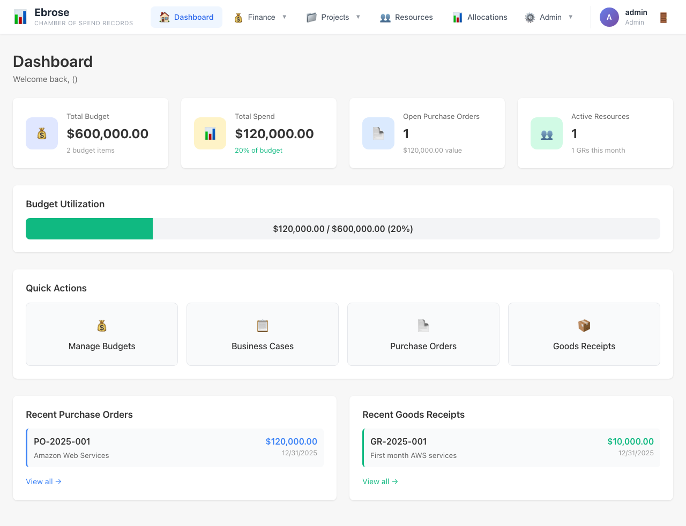

## Overview

The Ebrose frontend is a fully redesigned, production-ready Nuxt 4 application featuring a modern design system, reusable component library, and comprehensive test coverage.

## Features

### Design System
- **789 lines** of comprehensive CSS design tokens
- Complete color palette with semantic variants
- Typography scale (xs → 4xl)
- Spacing system (1-16)
- Shadow utilities (xs → xl)
- Border radius tokens
- Z-index management
- Smooth transitions and animations
- Accessibility utilities
- Print styles

### Component Library (11 Components)

All components are TypeScript-enabled, auto-imported by Nuxt, and fully tested.

#### Core Components
1. **BaseButton** - 5 variants, 4 sizes, loading states, icon support
2. **BaseInput** - Multiple input types, validation, prefix/suffix icons
3. **BaseModal** - 5 sizes, focus trap, body scroll lock, mobile responsive
4. **LoadingSpinner** - 5 sizes, 4 colors, accessible

#### Form Components
5. **BaseSelect** - Custom dropdown with v-model support
6. **BaseTextarea** - Multi-line input with character count

#### Display Components
7. **BaseBadge** - 6 variants, 3 sizes for status indicators
8. **BaseCard** - Content containers with header/footer slots
9. **BaseTable** - Data tables with sorting, selection, sticky headers
10. **EmptyState** - No data placeholders with actions
11. **BaseDropdown** - Dropdown menus with keyboard navigation

### Navigation
- Modern navigation with **Heroicons**
- Grouped dropdowns (Finance, Projects, Admin)
- Mobile-responsive hamburger menu
- User avatar and role display
- Logout functionality

### Pages (13 Total)

All pages fully migrated to use base components:

- **Authentication**: Login page
- **Dashboard**: Overview with stats and quick actions
- **Financial**: Budget Items, Business Cases, Line Items
- **Projects**: WBS, Assets, Purchase Orders, Goods Receipts
- **Resources**: Resources, Allocations
- **Admin**: User Groups, Audit Logs

## Screenshots

### Login
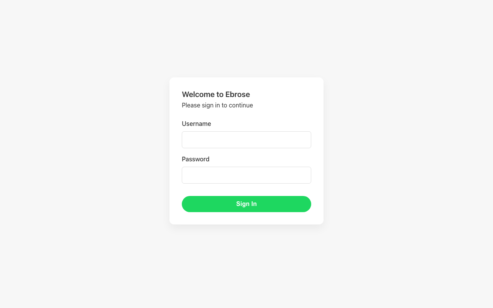
*Clean, modern login with BaseCard and BaseInput components*

### Dashboard

*Dashboard with Heroicons navigation, stat cards, and quick actions*

### Budget Items
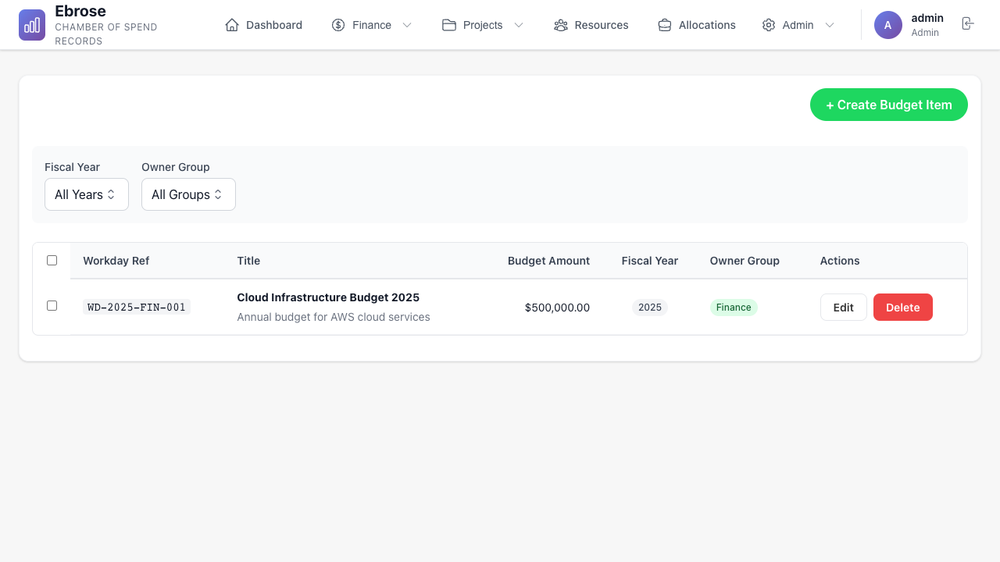
*BaseTable with sorting, filtering, and actions*

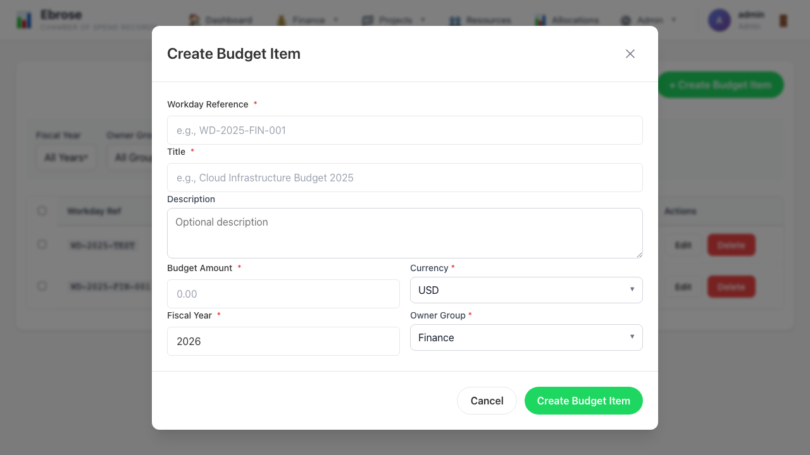
*BaseModal with form components*

### Purchase Orders
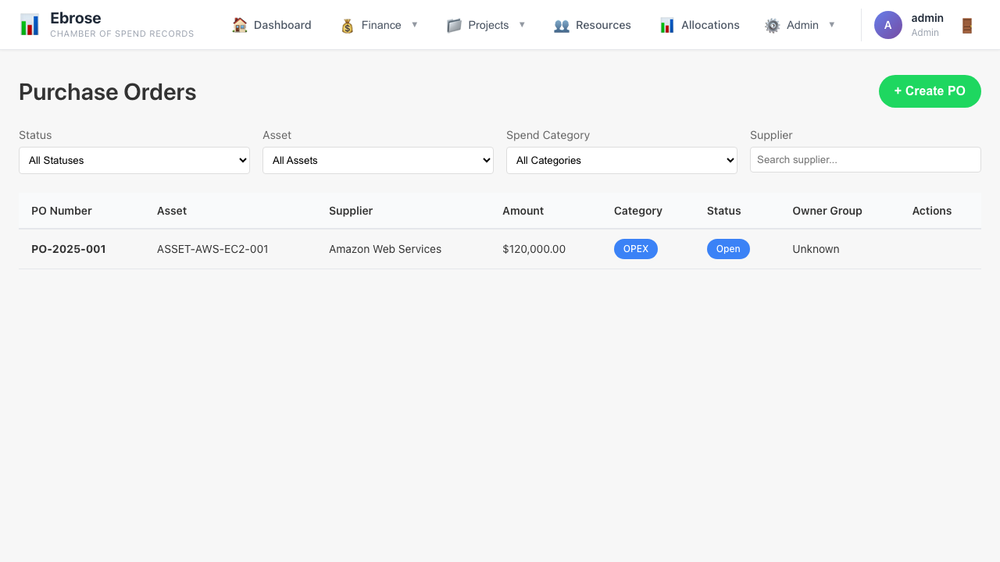
*Purchase orders management*


*Create purchase order form*

### WBS
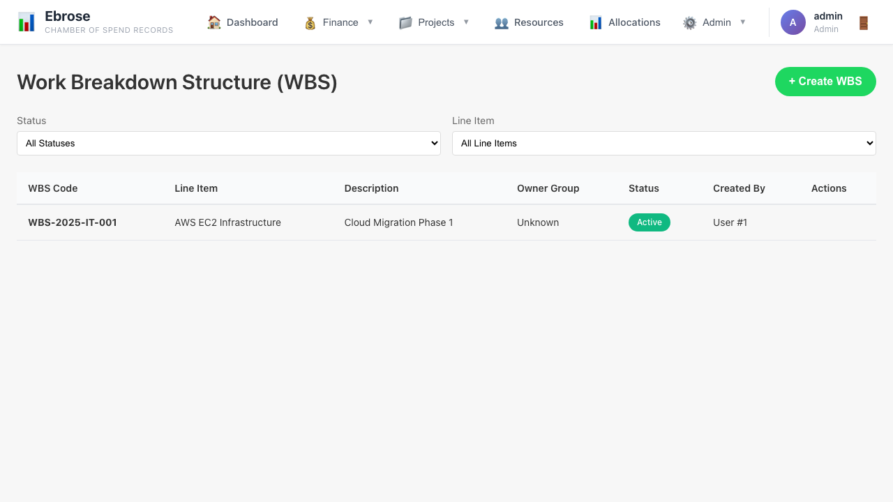
*Work breakdown structure*

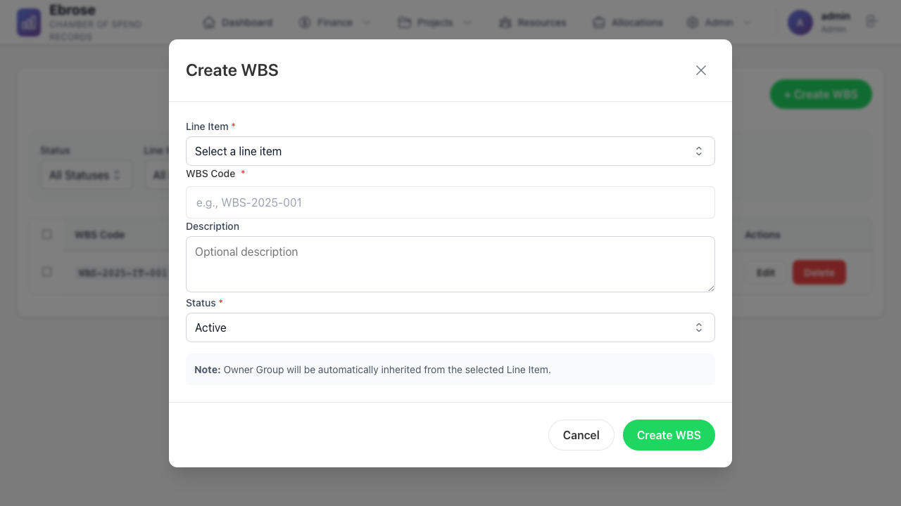
*Create WBS form*

### Assets
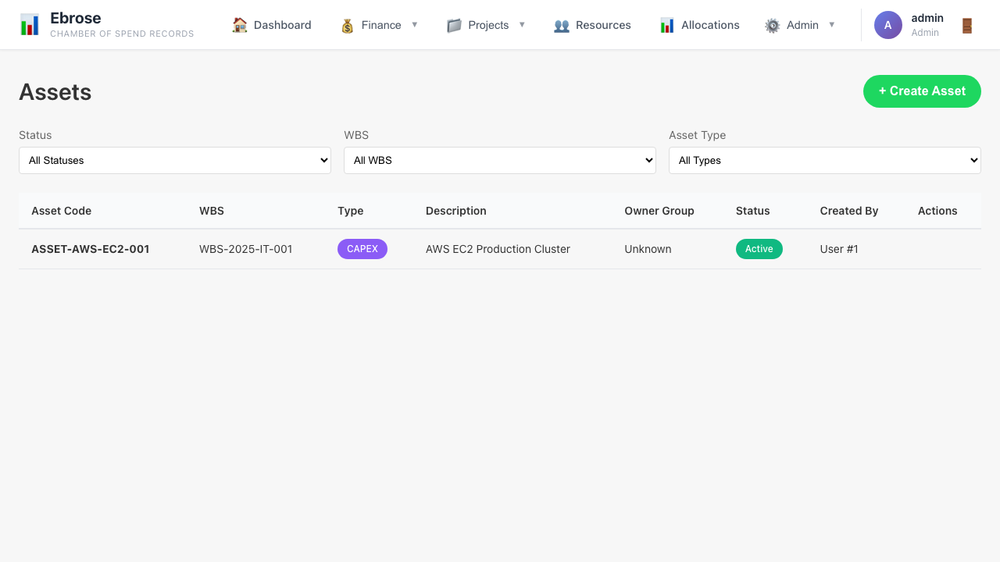
*Asset management*


*Create asset form*

### Admin - User Groups
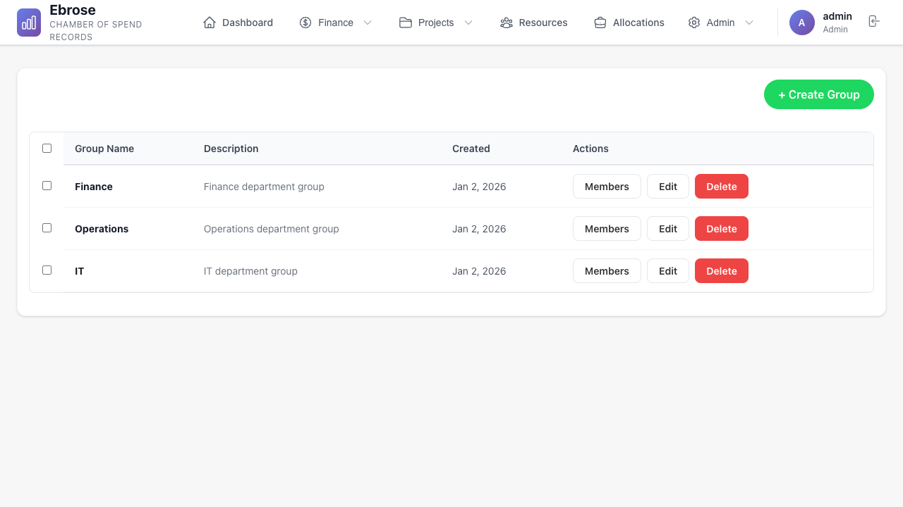
*User group management for Admin/Manager roles*

### Admin - Audit Logs
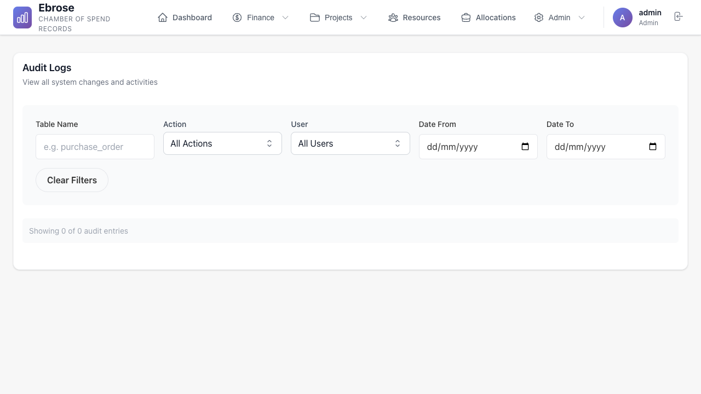
*Comprehensive audit trail with filtering*

### Business Cases
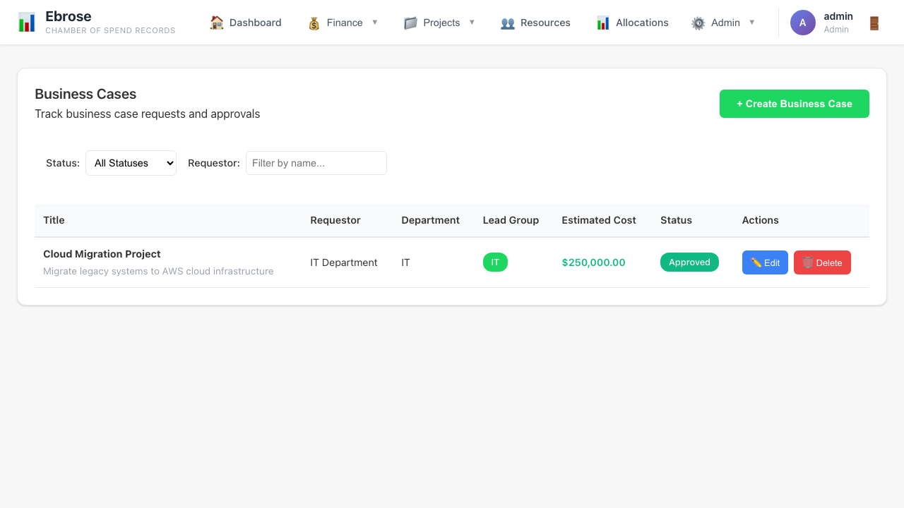
*Business case tracking and approval workflow*

### Goods Receipts

*Goods receipt management*

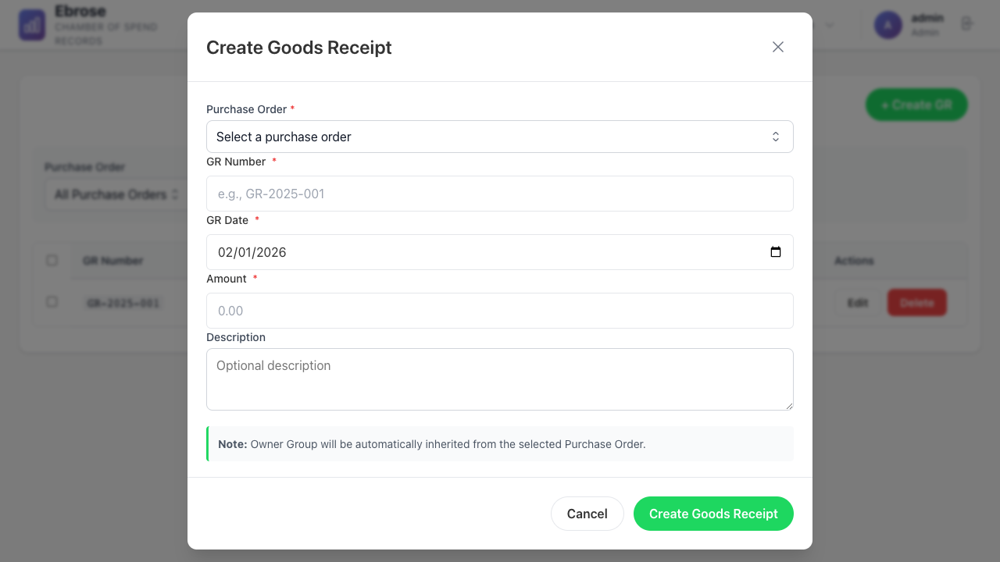
*Create goods receipt form*

## Test Coverage

### E2E Tests: 75/75 Passing (100%)

```bash
npm run test:e2e
```

Test suites include:
- Access control UI (8 tests)
- Audit log viewer (5 tests)
- Budget workflow (4 tests)
- CRUD operations (4 tests)
- Decimal money handling (3 tests)
- Entity inheritance (6 tests)
- Login flow (5 tests)
- Record sharing (5 tests)
- Role-based access (9 tests)
- Session authentication (6 tests)
- UI/UX feedback (4 tests)
- Screenshot capture (14 tests)

## Technology Stack

- **Framework**: Nuxt 4
- **UI Library**: Vue 3 Composition API
- **Icons**: Heroicons v2
- **Type Safety**: TypeScript
- **Testing**: Playwright (E2E), Vitest (Unit)
- **Build Tool**: Vite
- **Styling**: CSS Custom Properties (Design Tokens)

## Development

### Prerequisites
- Node.js 18+
- npm or pnpm

### Setup

```bash
# Install dependencies
npm install

# Start development server
npm run dev

# Run tests
npm run test:e2e

# Build for production
npm run build

# Preview production build
npm run preview
```

### Project Structure

```
frontend/
├── assets/
│   └── css/
│       └── main.css          # Design system (789 lines)
├── components/
│   └── base/                 # 11 reusable components
├── composables/
│   └── useIcons.ts           # Icon mapping system
├── layouts/
│   └── default.vue           # Main layout with navigation
├── pages/                    # 13 application pages
├── tests/
│   └── e2e/                  # 75 E2E tests
└── screenshots/              # 15 application screenshots
```

## Design Tokens

The design system uses CSS custom properties for consistency:

```css
/* Colors */
--color-primary: #2563eb
--color-success: #10b981
--color-warning: #f59e0b
--color-danger: #ef4444
--color-gray-50 through --color-gray-900

/* Typography */
--text-xs through --text-4xl

/* Spacing */
--spacing-1 through --spacing-16

/* Shadows */
--shadow-xs through --shadow-xl
```

## Component Usage

### BaseButton

```vue
<BaseButton
  variant="primary"
  size="md"
  :loading="isSubmitting"
  @click="handleSubmit"
>
  Save Changes
</BaseButton>
```

### BaseInput

```vue
<BaseInput
  v-model="form.email"
  type="email"
  label="Email Address"
  placeholder="you@example.com"
  :error="errors.email"
  required
/>
```

### BaseModal

```vue
<BaseModal v-model="showModal" title="Create Item" size="lg">
  <!-- Form content -->
  <template #footer>
    <BaseButton variant="secondary" @click="showModal = false">
      Cancel
    </BaseButton>
    <BaseButton variant="primary" @click="handleSave">
      Save
    </BaseButton>
  </template>
</BaseModal>
```

### BaseTable

```vue
<BaseTable
  :columns="tableColumns"
  :data="items"
  :loading="loading"
  selectable
  sticky-header
  @row-click="handleRowClick"
/>
```

## Accessibility

All components include:
- ARIA labels and roles
- Keyboard navigation support
- Focus management
- Screen reader compatibility
- High contrast support

## Browser Support

- Chrome/Edge (latest)
- Firefox (latest)
- Safari (latest)
- Mobile browsers (iOS Safari, Chrome Mobile)

## Performance

- Fast initial load with code splitting
- Lazy-loaded components
- Optimized images
- Minimal bundle size
- Server-side rendering (SSR) ready

## Contributing

See component specifications in `COMPONENT_SPECS.md` for detailed API documentation.

## License

See project root LICENSE file.

---

**Status**: ✅ Production Ready
**Last Updated**: January 2, 2026
**Test Coverage**: 75/75 (100%)
**Component Library**: 11/11 Complete
